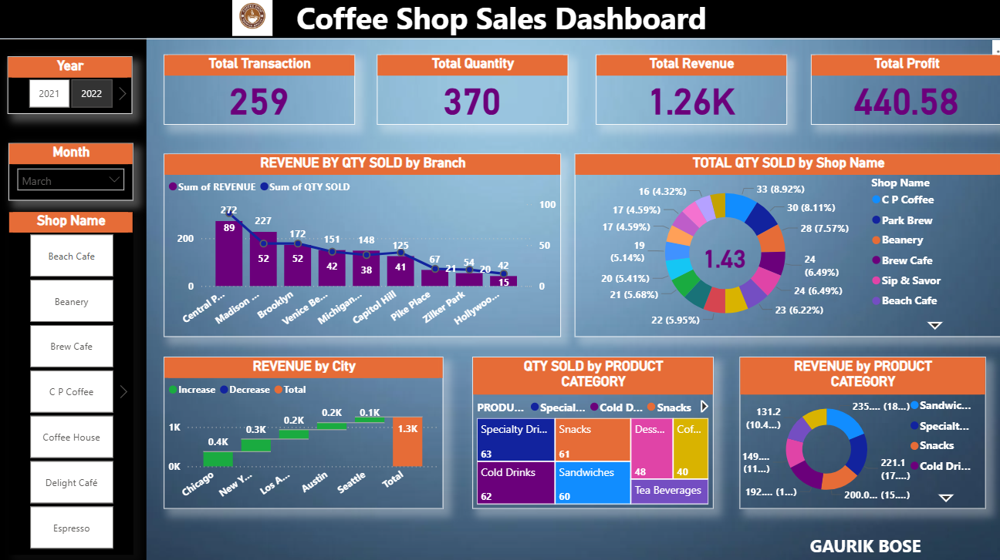

# Coffee Shop Sales Dashboard

## Overview

An interactive Power BI dashboard developed to analyze coffee shop sales performance across different branches, cities, shops, and product categories.

The dashboard provides a consolidated view of transactions, quantity sold, revenue, and profit, with interactive filters for year, month, and shop name.

## Tools Used

- Power BI
- Data Visualization
- Data Analysis
- Microsoft Excel

## Dashboard Features

- Total transaction analysis
- Total quantity sold
- Total revenue
- Total profit
- Revenue and quantity sold by branch
- Quantity sold by shop name
- Revenue by city
- Quantity sold by product category
- Revenue by product category
- Year-wise filtering
- Month-wise filtering
- Shop-wise filtering

## Key Metrics

- Total Transactions
- Total Quantity Sold
- Total Revenue
- Total Profit

## Dataset

The project uses transactional coffee shop sales data stored in an Excel workbook for analyzing sales performance across shops, branches, cities, and product categories.

## Dashboard Preview

## Project File

The Power BI `.pbix` file is included in this repository for further exploration of the dashboard and data model.

## Project Structure

Coffee-Shop-Sales-PowerBI/
│
├── Coffee_sales.pbix
├── README.md
│
├── data/
│   └── Coffee_Shop_Sales_Data.xlsx
│
└── screenshot/
    └── dashboard.png
